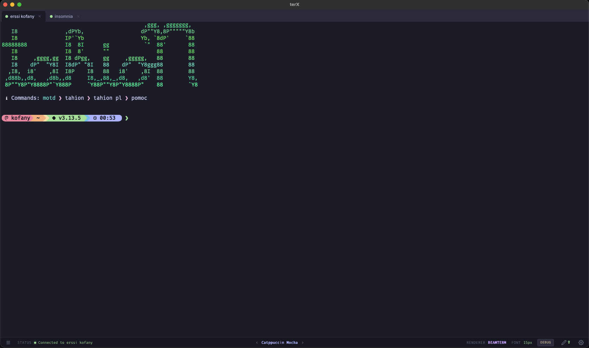
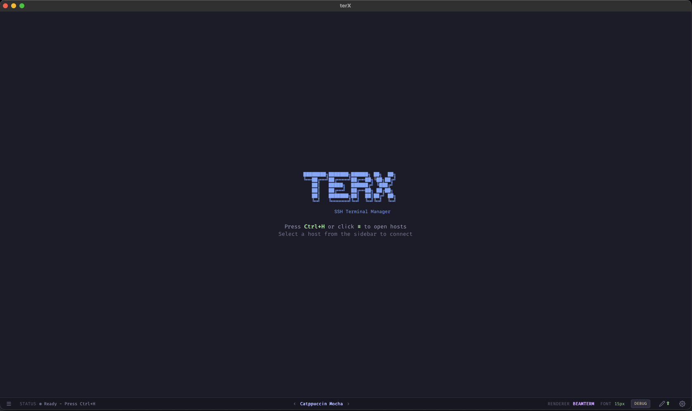
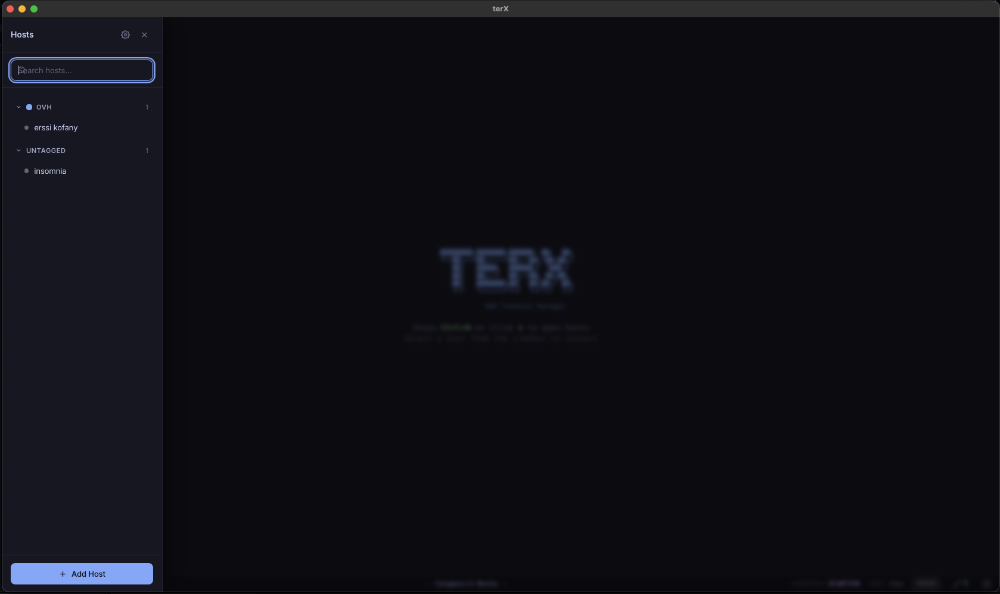
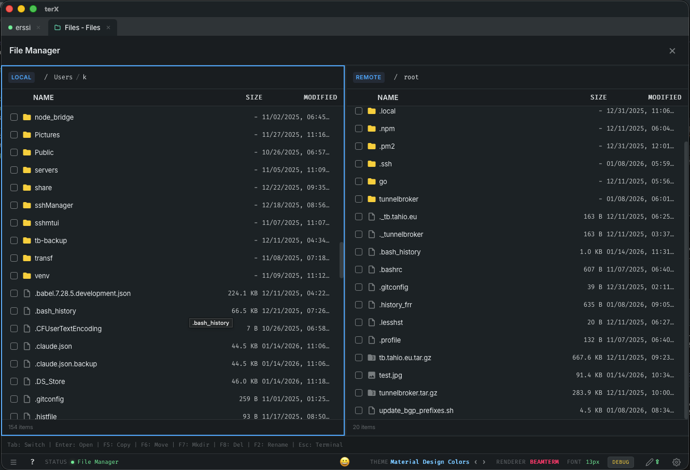
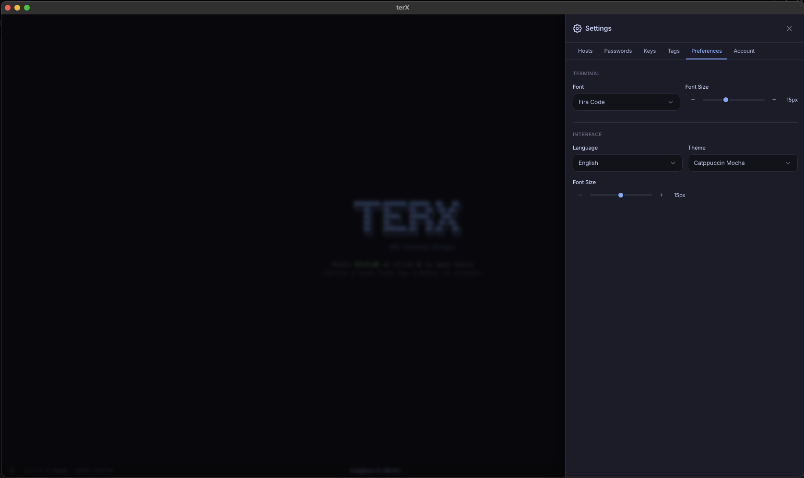
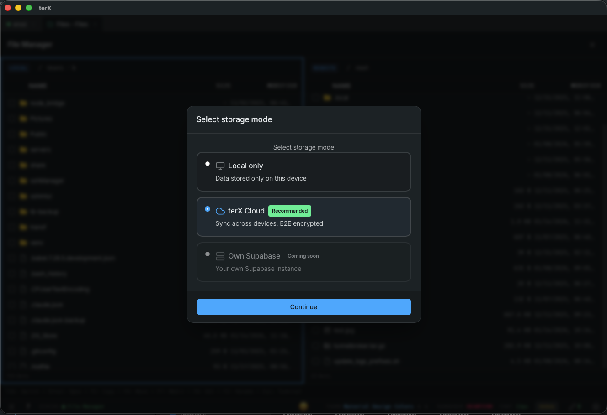

<div align="center">

# terX

### Cross-Platform SSH Client

[](https://github.com/OutrageLabs/terX/releases)
[](https://github.com/OutrageLabs/terX/releases/latest)
[](LICENSE)

**Secure SSH connections with GPU-accelerated terminal rendering**

[Download](#download) • [Features](#features) • [Documentation](#documentation) • [Support](#support)



</div>

---

## Features

- **SSH Connection Manager** — Save, organize, and quickly connect to your servers
- **Host Key Verification** — OpenSSH-style known_hosts with MITM protection
- **SFTP File Manager** — Dual-pane Norton Commander-style file browser
- **GPU-Accelerated Rendering** — WebGL2-powered terminal with sub-millisecond render times
- **End-to-End Encryption** — All credentials encrypted with AES-256-GCM + PBKDF2
- **Multiple Storage Options** — Local encrypted storage or terX Cloud sync
- **Native Text Selection** — Hardware-accelerated selection with auto-copy
- **Nerd Font Support** — Full icon and emoji rendering
- **Dark Themes** — Catppuccin Mocha, Dracula, and more
- **Cross-Platform** — Native apps for macOS, Windows, and Linux

## Screenshots

<p align="center">
  
  
</p>
<p align="center">
  
  
</p>
<p align="center">
  
  
</p>

## Download

| Platform | Architecture | Download |
|----------|--------------|----------|
| **macOS** | Apple Silicon (M1/M2/M3/M4) | [terX.dmg](https://github.com/OutrageLabs/terX/releases/latest) |
| **Windows** | x64 | [terX.exe](https://github.com/OutrageLabs/terX/releases/latest) |
| **Linux** | x64 | [terX.AppImage](https://github.com/OutrageLabs/terX/releases/latest) / [.deb](https://github.com/OutrageLabs/terX/releases/latest) |

### First Run

**macOS:** Right-click → Open (to bypass Gatekeeper on first launch)

**Linux:**
```bash
chmod +x terx_*.AppImage
./terx_*.AppImage
```

## Documentation

- [Installation Guide](docs/installation.md)
- [Getting Started](docs/getting-started.md)
- [Keyboard Shortcuts](docs/keyboard-shortcuts.md)
- [FAQ](docs/faq.md)

## Keyboard Shortcuts

| Shortcut | Action |
|----------|--------|
| `Ctrl/Cmd+H` | Toggle sidebar (host list) |
| `Ctrl/Cmd+,` | Toggle settings panel |
| `Ctrl/Cmd+T` | New tab (same host) |
| `Ctrl+Tab` | Switch to next tab |
| `Ctrl+Shift+Tab` | Switch to previous tab |
| `Ctrl/Cmd+W` | Close current tab |
| `F5` | Toggle file manager (when connected) |
| `Ctrl+F5` | Open file manager for transfer-only mode |
| `F1` | Toggle shortcuts help panel |
| `Shift+PageUp/PageDown` | Scroll terminal history |
| `Ctrl/Cmd++/-/0` | Zoom terminal font |

## Text Selection

terX supports two selection modes:

| Mode | Description |
|------|-------------|
| **Shift+Click** (default) | Hold `Shift` and drag to select text. Regular clicks are passed to terminal applications (e.g., for Midnight Commander, vim). |
| **Direct Selection** | Click and drag to select text directly. Terminal applications won't receive mouse clicks. |

Hold **Alt/Option** to enable block (rectangular) selection mode.

## Storage Options

| Mode | Status | Description |
|------|--------|-------------|
| **Local Storage** | Available | Encrypted JSON stored locally. All data protected with AES-256-GCM. |
| **terX Cloud** | Available | Sync across devices via Supabase. End-to-end encrypted. |
| **Self-Hosted** | Planned | Connect your own Supabase project for self-hosted cloud storage. |

## Security

- **Host Key Verification** — Protects against MITM attacks with SHA256/MD5 fingerprints
- **Master Password** — All sensitive data encrypted locally
- **No Plain Text** — Credentials never stored unencrypted
- **System Keychain** — Optional integration with OS keychain
- **E2E Encryption** — Cloud sync uses client-side encryption

See [SECURITY.md](SECURITY.md) for reporting vulnerabilities.

## Support

- **Issues**: [GitHub Issues](https://github.com/OutrageLabs/terX/issues)
- **Discussions**: [GitHub Discussions](https://github.com/OutrageLabs/terX/discussions)

## License

This software is proprietary. See [LICENSE](LICENSE) for details.

---

<div align="center">

**[OutrageLabs](https://github.com/OutrageLabs)**

</div>
