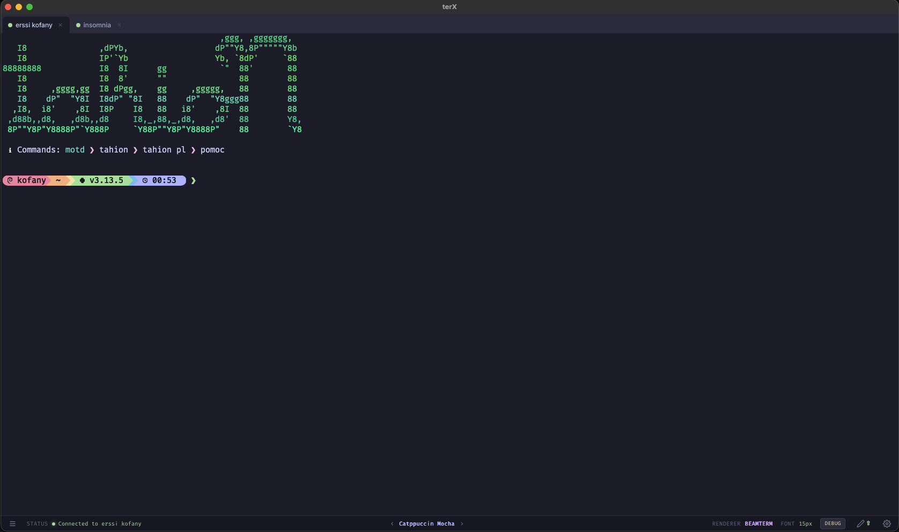
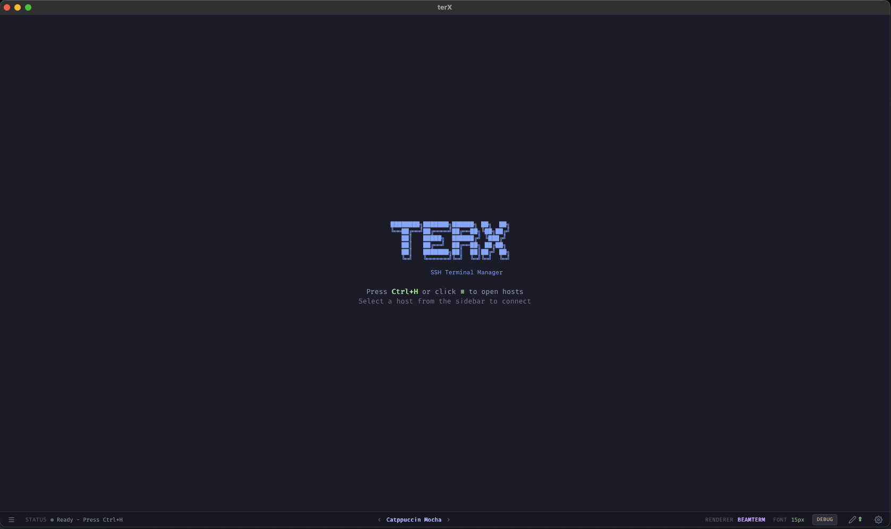
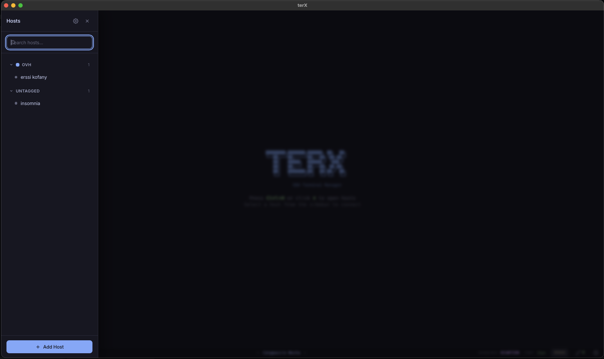
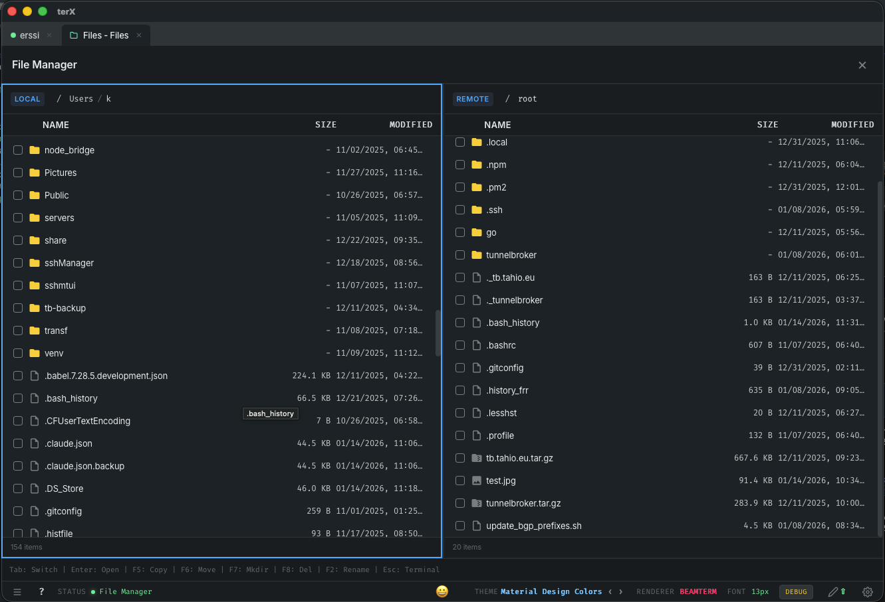
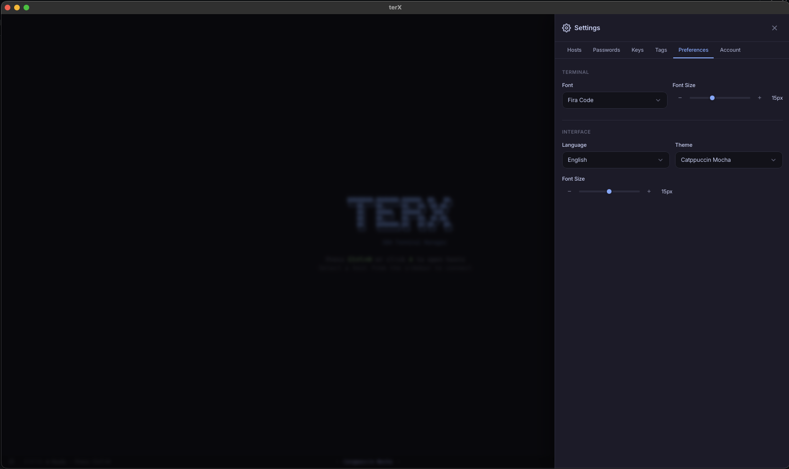
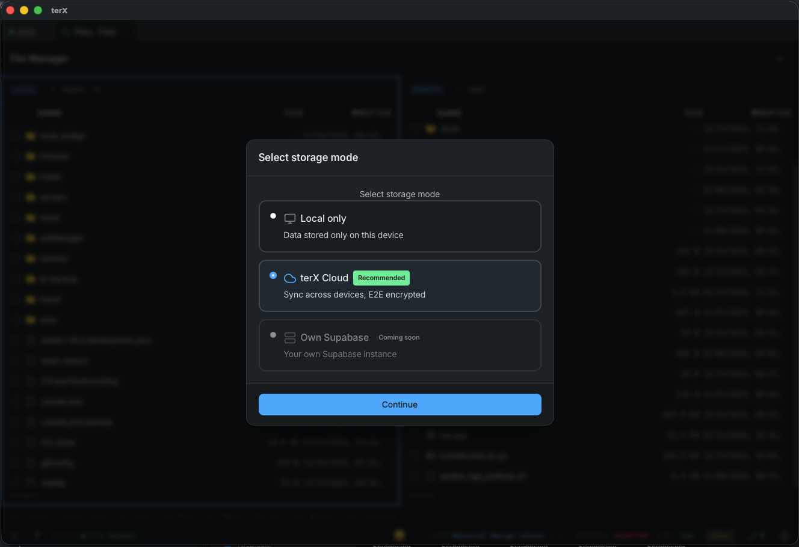

<div align="center">

# terX

### Cross-Platform SSH Client

[](LICENSE)
[](https://github.com/OutrageLabs/terX/releases)
[](https://github.com/OutrageLabs/terX/releases/tag/v0.1.9)

**Secure SSH connections with GPU-accelerated terminal rendering**

[Download](#download) • [Features](#features) • [Build](#build-from-source) • [Architecture](#architecture)



</div>

---

## Features

- **SSH Connection Manager** — Save, organize, and quickly connect to your servers
- **Host Key Verification** — OpenSSH-style known_hosts with MITM protection
- **SFTP File Manager** — Dual-pane Norton Commander-style file browser (Ctrl+F5)
- **GPU-Accelerated Rendering** — WebGL2-powered terminal with sub-millisecond render times
- **End-to-End Encryption** — All credentials encrypted with AES-256-GCM + PBKDF2
- **Multiple Storage Options** — Local encrypted storage or terX Cloud sync
- **Native Text Selection** — Hardware-accelerated selection with auto-copy
- **Nerd Font Support** — Full icon and emoji rendering
- **Dark Themes** — Catppuccin Mocha, Dracula, and more
- **Cross-Platform** — Native apps for macOS, Windows, and Linux

## Screenshots

<p align="center">
  
  
</p>
<p align="center">
  
  
</p>
<p align="center">
  
  
</p>

## Download

| Platform | Architecture | Download |
|----------|--------------|----------|
| **macOS** | Apple Silicon (M1/M2/M3/M4) | [terX.dmg](https://github.com/OutrageLabs/terX/releases/latest) |
| **Windows** | x64 | [terX.exe](https://github.com/OutrageLabs/terX/releases/latest) |
| **Linux** | x64 | [terX.AppImage](https://github.com/OutrageLabs/terX/releases/latest) / [.deb](https://github.com/OutrageLabs/terX/releases/latest) |

### First Run

**macOS:** Right-click → Open (to bypass Gatekeeper on first launch)

**Linux:**
```bash
chmod +x terX_*.AppImage
./terX_*.AppImage
```

## Tech Stack

| Layer | Technology |
|-------|------------|
| **Framework** | [Tauri 2.0](https://tauri.app/) — Rust backend, web frontend |
| **VT Parser** | [Ghostty WASM](https://ghostty.org/) — Battle-tested VT100 implementation |
| **Renderer** | [beamterm](https://github.com/junkdog/beamterm) — WebGL2 GPU-accelerated rendering |
| **SSH Client** | [russh](https://github.com/warp-tech/russh) — Pure Rust SSH implementation |
| **Encryption** | AES-256-GCM with PBKDF2 key derivation |
| **Cloud Sync** | [Supabase](https://supabase.com/) (optional) |

## Build from Source

### Prerequisites

- [Bun](https://bun.sh/) (package manager)
- [Rust](https://rustup.rs/) (stable toolchain)
- Platform-specific dependencies (see below)

### macOS

```bash
# Clone repository
git clone https://github.com/OutrageLabs/terX.git
cd terX

# Install dependencies and build
bun install
bun run tauri build
```

### Windows

Requires [Visual Studio Build Tools](https://visualstudio.microsoft.com/downloads/) with C++ workload.

```powershell
# Clone and build
git clone https://github.com/OutrageLabs/terX.git
cd terX
bun install
bun run tauri build
```

### Linux

```bash
# Install system dependencies (Debian/Ubuntu)
sudo apt-get install -y \
    libwebkit2gtk-4.1-dev \
    libgtk-3-dev \
    libayatana-appindicator3-dev \
    librsvg2-dev \
    patchelf

# Clone and build
git clone https://github.com/OutrageLabs/terX.git
cd terX
bun install
bun run tauri build
```

### Development

```bash
bun install
bun run tauri dev
```

## Architecture

```
┌───────────────────────────────────────────────────────────┐
│                     terX Application                      │
├───────────────────────────────────────────────────────────┤
│  Frontend (TypeScript)                                    │
│  ├─ Terminal UI with WebGL2 canvas                        │
│  ├─ SSH session management                                │
│  └─ Encrypted credential storage                          │
├───────────────────────────────────────────────────────────┤
│  ghostty-web (WASM)                                       │
│  ├─ VT100/VT220 parser (from Ghostty)                     │
│  └─ xterm.js-compatible Terminal API                      │
├───────────────────────────────────────────────────────────┤
│  beamterm (WASM + WebGL2)                                 │
│  ├─ GPU-accelerated cell rendering                        │
│  ├─ Dynamic font atlas (NerdFonts, emoji)                 │
│  └─ Native text selection                                 │
├───────────────────────────────────────────────────────────┤
│  Rust Backend (Tauri)                                     │
│  ├─ SSH client (russh)                                    │
│  ├─ System keychain integration                           │
│  └─ Secure IPC bridge                                     │
└───────────────────────────────────────────────────────────┘
                          │
                          │ SSH Protocol
                          ▼
                 ┌─────────────────┐
                 │  Remote Server  │
                 └─────────────────┘
```

## Text Selection

terX supports two selection modes for terminal text:

| Mode | Description |
|------|-------------|
| **Shift+Click** (default) | Hold `Shift` and drag to select text. Regular clicks are passed to terminal applications (e.g., for Midnight Commander, vim). |
| **Direct Selection** | Click and drag to select text directly. Terminal applications won't receive mouse clicks. |

Toggle between modes using the **selection icon** in the bottom-right corner of the application.

## Storage Options

| Mode | Status | Description |
|------|--------|-------------|
| **Local Storage** | Available | Encrypted JSON stored locally. All data protected with AES-256-GCM. |
| **terX Cloud** | Available | Sync across devices via Supabase. End-to-end encrypted. |
| **Self-Hosted** | Planned | Connect your own Supabase project for self-hosted cloud storage. |

## Security

- **Host Key Verification** — Protects against MITM attacks with SHA256/MD5 fingerprints and visual randomart
- **Master Password** — All sensitive data encrypted locally
- **No Plain Text** — Credentials never stored unencrypted
- **System Keychain** — Optional integration with OS keychain
- **E2E Encryption** — Cloud sync uses client-side encryption

## License

[MIT](LICENSE)

---

<div align="center">

**[OutrageLabs](https://github.com/OutrageLabs)** • Made with Rust, TypeScript, and WebAssembly

</div>
