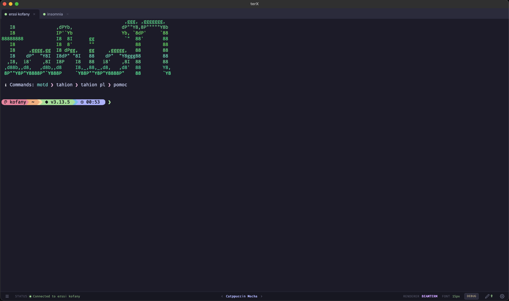
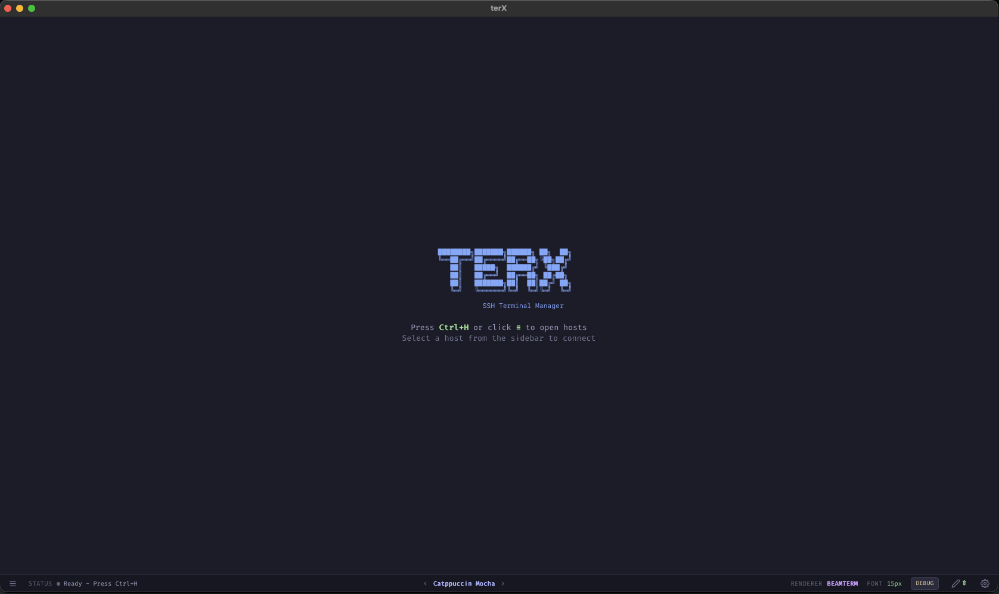
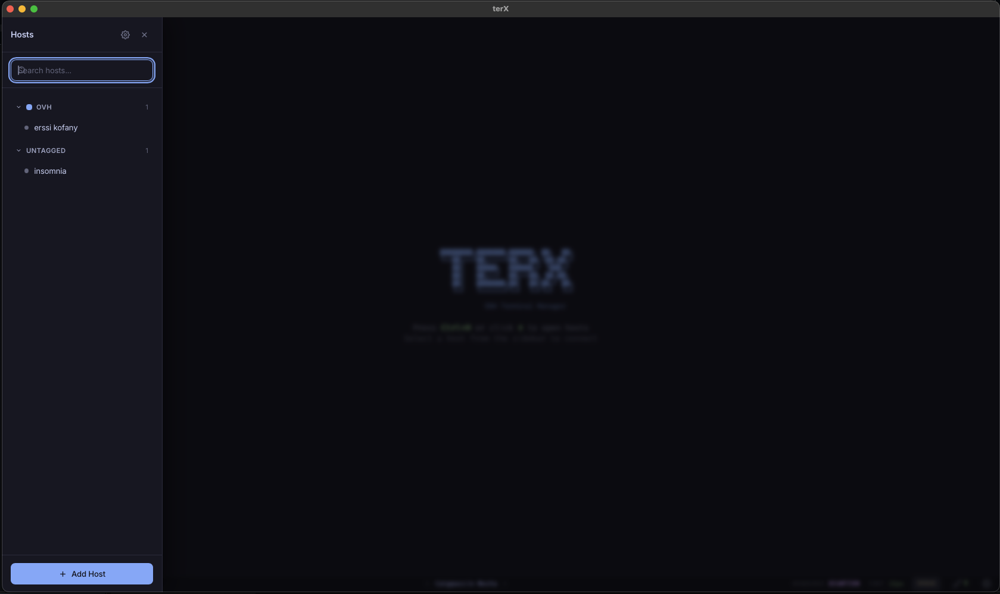
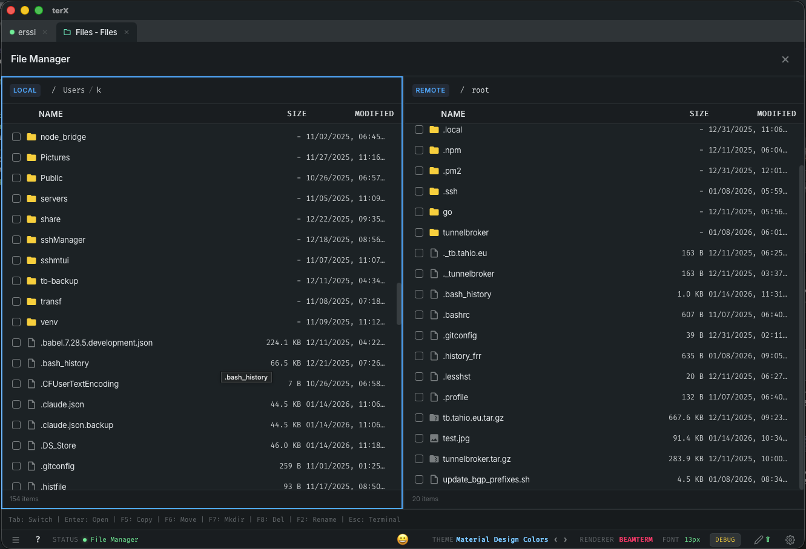
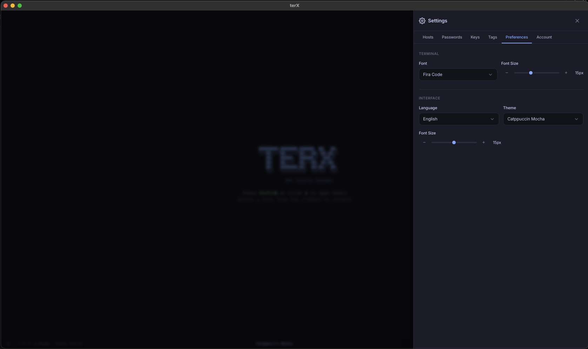
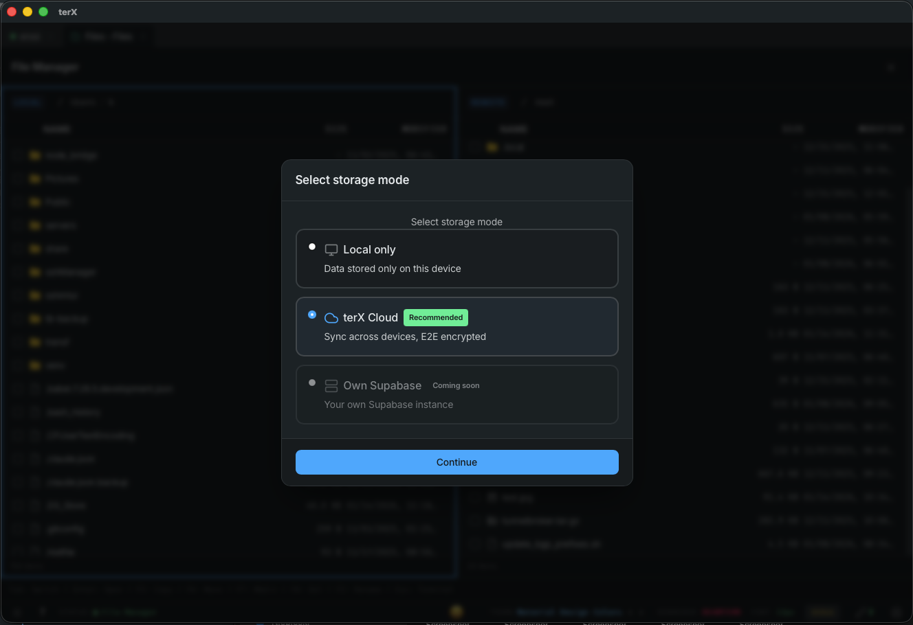

<div align="center">

# terX

### Cross-Platform SSH Client

[](https://github.com/OutrageLabs/terX/releases)
[](https://github.com/OutrageLabs/terX/releases/latest)
[](LICENSE)
[](https://aur.archlinux.org/packages/terx-bin)

**Secure SSH connections with GPU-accelerated terminal rendering**

[Download](#download) • [Features](#features) • [Documentation](#documentation) • [Support](#support)



</div>

---

## Features

- **SSH Connection Manager** — Save, organize, and quickly connect to your servers with tags and search
- **SSH Agent Support** — Authenticate using keys from your system SSH agent (ssh-agent, gpg-agent, 1Password etc.)
- **Agent Forwarding** — Forward your local SSH agent to remote servers for seamless key-based operations
- **Local Port Forwarding (-L)** — Tunnel local ports to remote services with per-host config, auto-start, ad-hoc management, and real-time status
- **Host Key Verification** — OpenSSH-style known_hosts with MITM protection (SHA256/MD5 fingerprints)
- **Multi-Tab Sessions** — Open multiple terminal sessions in tabs, including multiple connections to the same host
- **SFTP File Manager** — Dual-pane Norton Commander-style file browser with drag & drop
- **GPU-Accelerated Rendering** — WebGL2-powered terminal (beamterm) with sub-millisecond render times
- **Kitty Graphics Protocol** — Inline image display with fullscreen popup, pan & zoom
- **End-to-End Encryption** — All credentials encrypted with AES-256-GCM + PBKDF2
- **Multiple Storage Options** — Local encrypted storage or terX Cloud sync across devices
- **Native Text Selection** — Hardware-accelerated selection with block/rectangular mode
- **Nerd Font Support** — Full icon and emoji rendering out of the box
- **Theme Collection** — Catppuccin Mocha, Dracula, Tokyo Night, and more
- **Internationalization** — English and Polish UI
- **Cross-Platform** — Native apps for macOS (Apple Silicon & Intel), Windows, and Linux

## Screenshots

<p align="center">
  
  
</p>
<p align="center">
  
  
</p>
<p align="center">
  
  
</p>

## Download

| Platform | Architecture | Formats |
|----------|--------------|---------|
| **macOS** | Apple Silicon (M1/M2/M3/M4) | [.dmg](https://github.com/OutrageLabs/terX/releases/latest) |
| **macOS** | Intel (x64) | [.dmg](https://github.com/OutrageLabs/terX/releases/latest) |
| **Windows** | x64 | [.exe](https://github.com/OutrageLabs/terX/releases/latest) / [.msi](https://github.com/OutrageLabs/terX/releases/latest) |
| **Linux** | x64 | [.AppImage](https://github.com/OutrageLabs/terX/releases/latest) / [.deb](https://github.com/OutrageLabs/terX/releases/latest) / [.rpm](https://github.com/OutrageLabs/terX/releases/latest) |
| **Arch Linux** | x64 | [AUR (terx-bin)](https://aur.archlinux.org/packages/terx-bin) |

### Installation

**macOS:** Right-click → Open (to bypass Gatekeeper on first launch)

**Windows:** Run the `.exe` installer or use the `.msi` package.

**Linux (AppImage):**
```bash
chmod +x terx_*.AppImage
./terx_*.AppImage
```

**Arch Linux (AUR):**
```bash
yay -S terx-bin
```

## Authentication Methods

| Method | Description |
|--------|-------------|
| **Password** | Saved encrypted passwords or manual entry at connection time |
| **SSH Key** | Import private keys (Ed25519, RSA, ECDSA) with optional passphrase |
| **SSH Agent** | Use keys from your system SSH agent (ssh-agent, gpg-agent, 1Password SSH agent, etc.) |

**Agent Forwarding** can be enabled per-host to forward your local SSH agent to remote servers, allowing operations like `git pull` on remote machines using your local keys.

## Port Forwarding

terX supports **Local Port Forwarding (-L)** — tunnel local ports through SSH to reach services on remote networks.

| Feature | Description |
|---------|-------------|
| **Per-host config** | Configure forwards in host settings, saved with the host |
| **Auto-start** | Enabled forwards start automatically when you connect |
| **Ad-hoc forwarding** | Add new forwards while connected via the status bar |
| **Real-time status** | See active tunnels, connection count, and errors in the status bar |
| **Cleanup on disconnect** | All forwards are stopped when the SSH session ends |

**Example:** Forward local port 15432 to a remote PostgreSQL database:
- Local: `127.0.0.1:15432` → Remote: `127.0.0.1:5432`
- Connect, then open `localhost:15432` in your database tool

*Remote (-R) and Dynamic (-D / SOCKS5) forwarding are planned for future releases.*

## Keyboard Shortcuts

| Shortcut | Action |
|----------|--------|
| `Ctrl/Cmd+H` | Toggle sidebar (host list) |
| `Ctrl/Cmd+,` | Toggle settings panel |
| `Ctrl/Cmd+T` | New tab (same host) |
| `Ctrl+Tab` | Next tab |
| `Ctrl+Shift+Tab` | Previous tab |
| `Ctrl/Cmd+W` | Close current tab |
| `F1` | Toggle shortcuts help panel |
| `Ctrl+Shift+E` | Open emoji picker |
| `Shift+PageUp/PageDown` | Scroll terminal history |
| `Ctrl/Cmd++/-/0` | Zoom terminal font |

## Text Selection

terX supports two selection modes (configurable in settings):

| Mode | Description |
|------|-------------|
| **Shift+Click** (default) | Hold `Shift` and drag to select. Regular clicks pass through to terminal apps (vim, MC, irssi). |
| **Direct Selection** | Click and drag to select directly. Terminal apps won't receive mouse clicks. |

Hold **Alt/Option** to toggle block (rectangular) selection mode.

## Storage Options

| Mode | Status | Description |
|------|--------|-------------|
| **Local Storage** | Available | Encrypted JSON stored locally. All data protected with AES-256-GCM. |
| **terX Cloud** | Available | Sync across devices via Supabase. End-to-end encrypted. |
| **Self-Hosted** | Planned | Connect your own Supabase instance for self-hosted cloud storage. |

## Security

- **Host Key Verification** — Protects against MITM attacks with SHA256/MD5 fingerprint display
- **Master Password** — All sensitive data encrypted locally before storage
- **No Plain Text** — Credentials never stored unencrypted, anywhere
- **System Keychain** — Optional integration with OS keychain
- **E2E Encryption** — Cloud sync uses client-side encryption (server never sees plaintext)
- **SSH Agent** — Keys never leave the agent; only signatures are transmitted

See [SECURITY.md](SECURITY.md) for reporting vulnerabilities.

## Documentation

- [Installation Guide](docs/installation.md)
- [Getting Started](docs/getting-started.md)
- [Keyboard Shortcuts](docs/keyboard-shortcuts.md)
- [FAQ](docs/faq.md)

## Tech Stack

| Component | Technology |
|-----------|------------|
| Framework | [Tauri 2.0](https://tauri.app/) (Rust + Web) |
| VT Parser | [Ghostty](https://ghostty.org/) WASM |
| Renderer | [beamterm](https://github.com/junkdog/beamterm) WebGL2 |
| SSH Client | [russh](https://github.com/warp-tech/russh) |
| UI | [daisyUI 5](https://daisyui.com/) + Tailwind CSS 4 |

## Support

- **Issues**: [GitHub Issues](https://github.com/OutrageLabs/terX/issues)
- **Discussions**: [GitHub Discussions](https://github.com/OutrageLabs/terX/discussions)

## License

This software is proprietary. See [LICENSE](LICENSE) for details.

---

<div align="center">

**[OutrageLabs](https://github.com/OutrageLabs)**

</div>
